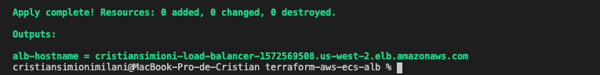
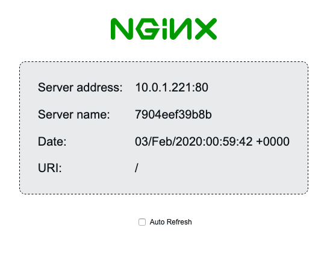

# Terraform + AWS + ECS + ALB

### How to test this infrastructure:


1) Run the following commands:

```
terraform init
terraform apply -auto-approve
```

2) Enter your AWS credentials

3) After creating everything, the load balancer dns name will appear. For example:



4) Open it on a browser



Enjoy! :smile:
